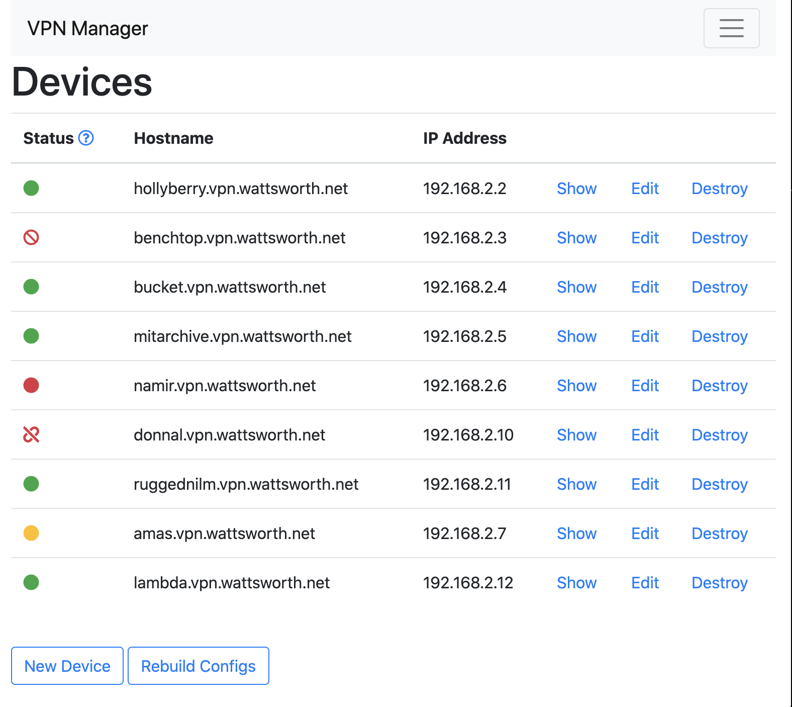
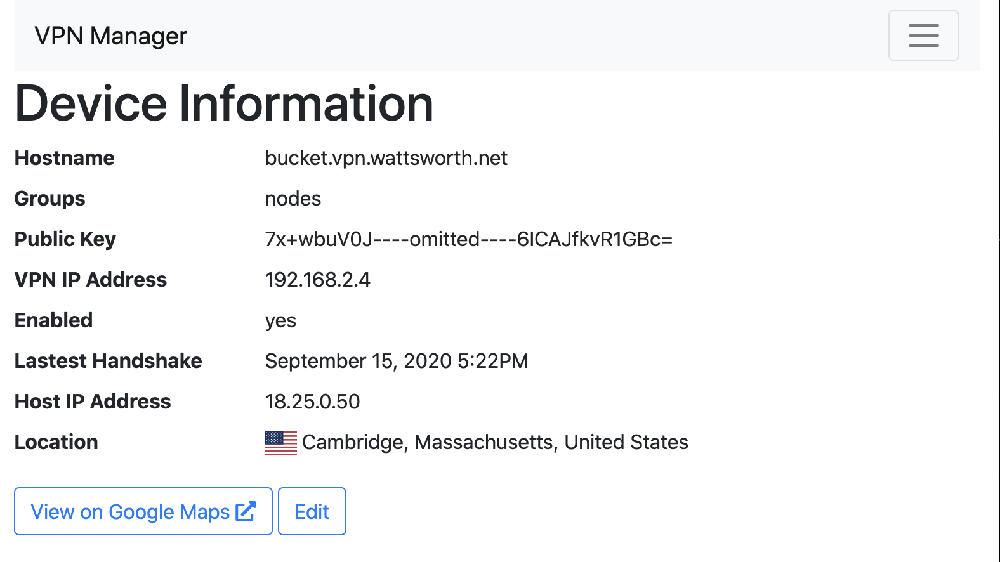
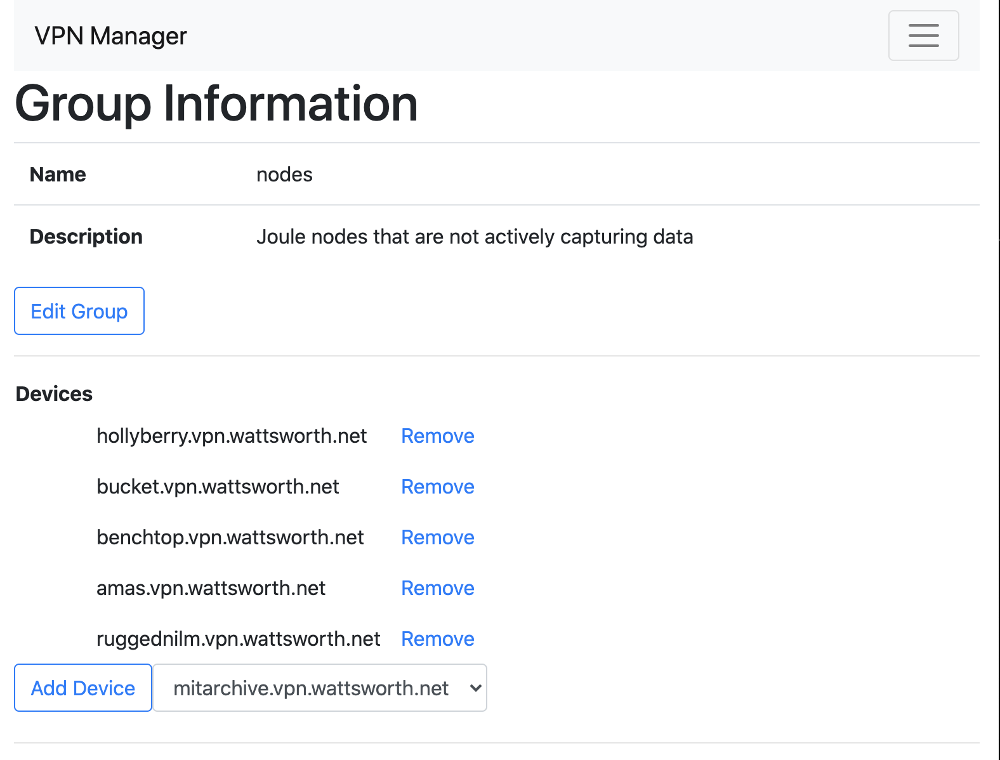

#VPN Manager

This is a web application to manage a VPN server using 
Wireguard, Dnsmasq, and Nagios. It automatically generates
the required configuration files and restarts system services
as required. It also tracks the state of VPN nodes and provides
Google Map links based on their local IP address.



### Device Overview



### Device Groups
Groups are used for Nagios monitoring. You must define services
for the host group separately in the Nagios configuration.



# How to Use
1. The following software can be managed, you can install any combination
of them (although they are all useful and recommended) 
    * Wireguard (https://www.wireguard.com/) 
    * Dnsmasq (http://www.thekelleys.org.uk/dnsmasq/doc.html)
    * Nagios (https://www.nagios.org/projects/nagios-core/)
2. Modify the contents of ``config/initializers/app_settings.rb`` with your
specific values. The default values should work for development but you must
add a valid IPStack API key. If you do not want to manage a service leave the 
restart command blank.
3. Add a cron job or systemd timer to run the rake ``devices:update`` task at least every 4 minutes.
Otherwise the color indicators will show yellow or red icons for the devices. This
task executes quickly as it just parses the output of ``wg show`` and only makes IPStack
API queries if a device's host address changes.
4. Create a user with the Rails console:
    ```ruby
    bundle exec rails c
    >> User.create(email: "youremail@adddress.com", password: "t0psecr3t")
    ```                                                                    
    Or, if you do not want to use authentication you can remove the ``authenticate_user!`` action
    at the top of the Device and Groups controller.
    
# Test and Development
Run tests with ``bundle exec rspec``. The test environment stubs all API calls with vcr so you do not need
to customize ``app_settings.rb``. To run the site in development you can leave
the defaults in ``app_settings.rb`` but you must add a valid IPStack API key.


    